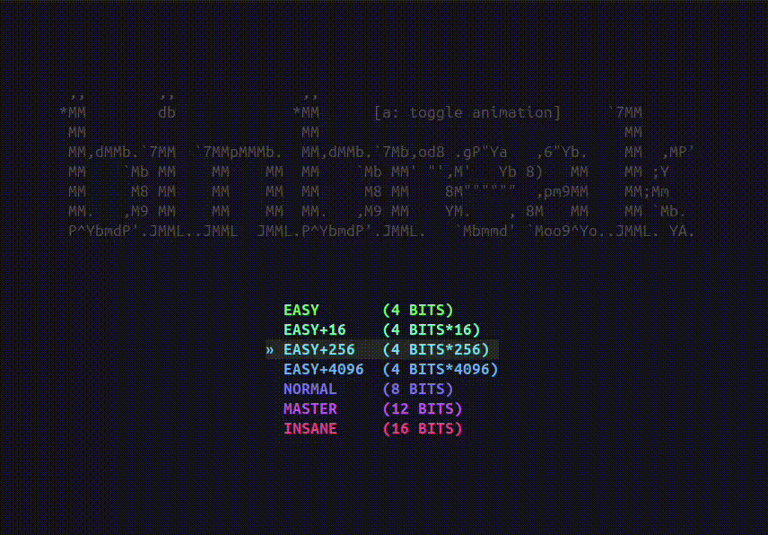
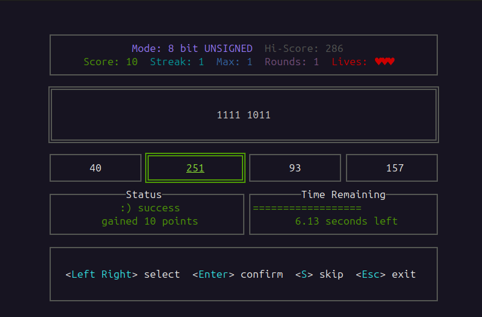
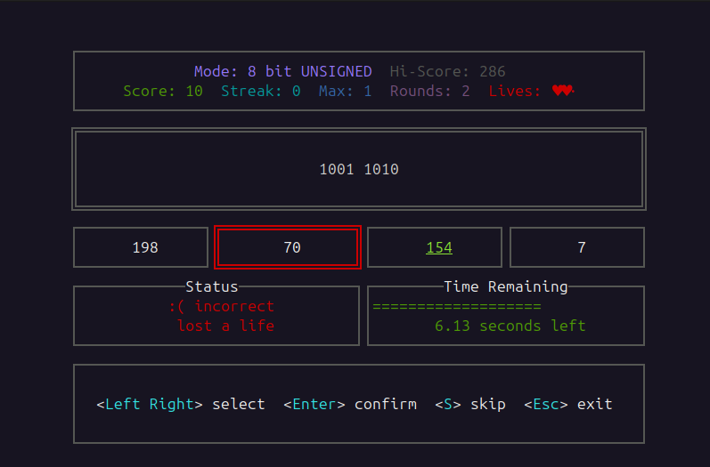
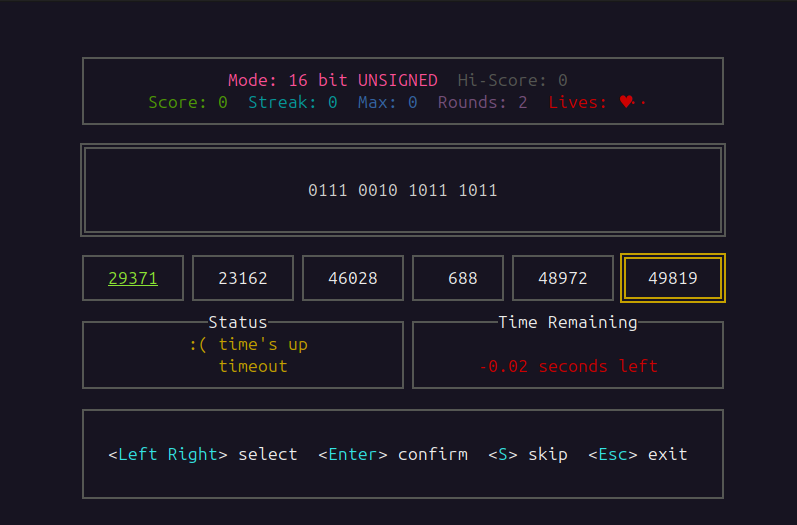
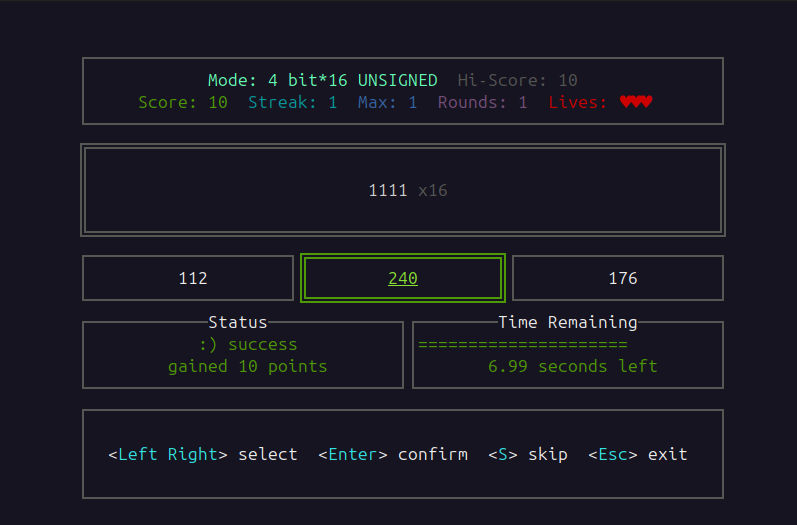
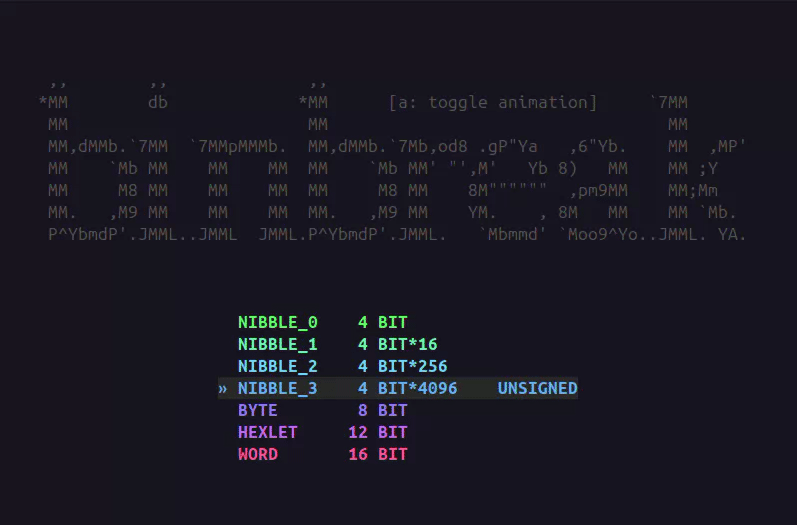
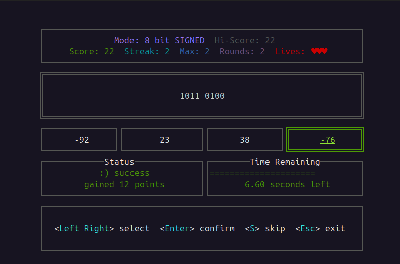

[](https://github.com/epic-64/binbreak/actions)
[](https://ratatui.rs/)



Guess the correct number (from binary to decimal) before time runs out!


Or lose a life trying.


Includes up to 16-bit modes for the ultimate challenge.


Includes multiple 4-bit modes, to train individual nibbles.


All bit-modes can also be played in signed or unsigned mode. (toggle via left/right keys)


Signed mode includes negative numbers and requires knowledge of two's complement.


## Can you crack the high score?
The longer your streak, the more points you get, but the faster the timer runs out!

High scores are tracked for each game-mode separately, and saved in a text file relative to the executable.

## Play
Download the release for your platform, see [Releases](https://github.com/epic-64/binbreak/releases).  
There is one file for linux and one for windows (.exe).

## Linux
- download the file `binbreak-linux`
- open a terminal and navigate to the folder where you downloaded it, e.g. `cd ~/Downloads`
- make it executable: `chmod +x binbreak-linux`
- run the game: `./binbreak-linux`

## Controls
- use the arrow or vim keys for navigation
- use left/right to toggle signed/unsigned mode
- press Enter to confirm choices
- press Esc or Q to exit a game mode or the game. CTRL+C also works to exit the game.

## Recommended terminals
The game should run fine in any terminal. If you want retro CRT effects, here are some recommendations:
- Windows: Windows Terminal (enable experimental "retro mode")
- Linux: Rio (with CRT shader), Cool Retro Term

## Build/Run from source
You may be inclined to not run binaries from the internet, and want to build from source instead.

- download the source code
- make sure you have Rust and Cargo installed, see [rustup.rs](https://rustup.rs/)
- open a terminal and navigate to the folder where you downloaded the source code, e.g. `cd ~/Downloads/binbreak`
- build the project: `cargo build --release`

## Run
```bash
cargo run --release
```

# Contributing

All pull requests are automatically checked by GitHub Actions CI, which runs tests,
clippy, and formatting checks on Linux, Windows, and macOS.

## Test
```bash
cargo test
```

## Lint
```bash
cargo clippy
```

## Format
```bash
cargo fmt
```

## License
MIT license ([LICENSE](LICENSE) or http://opensource.org/licenses/MIT)
